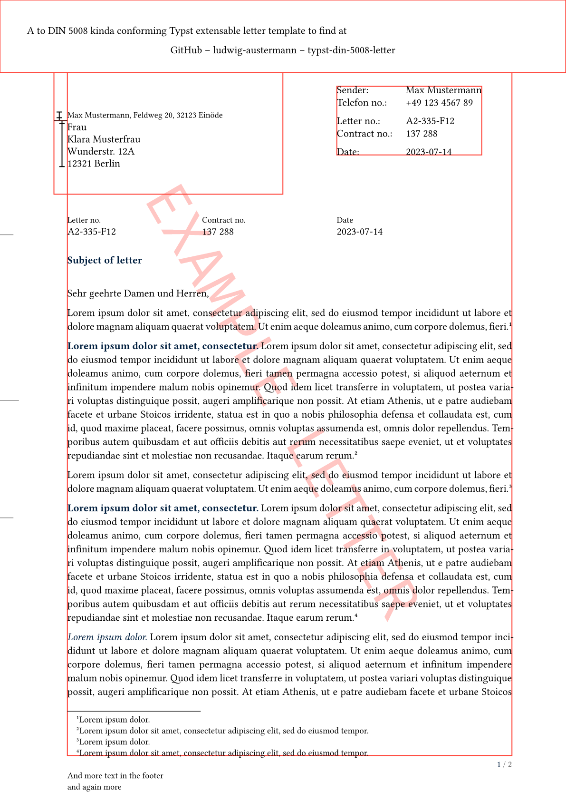
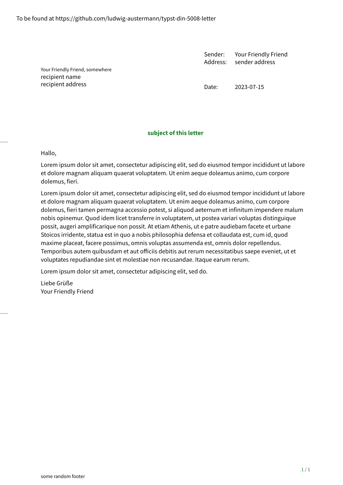
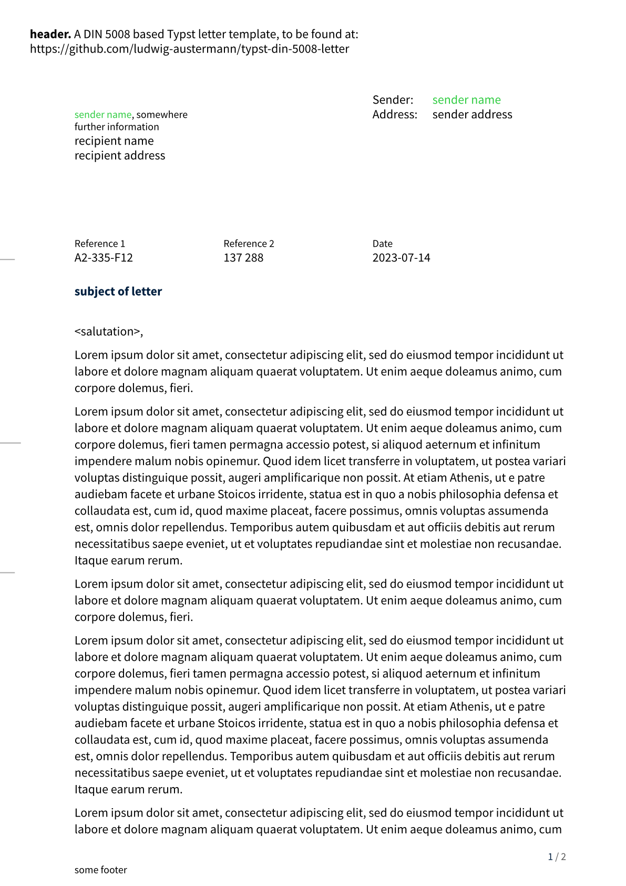
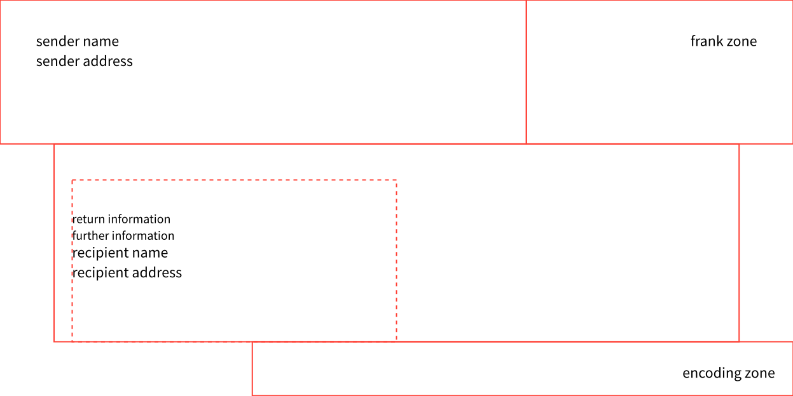

# typst-din-5008-letter
A template for [DIN 5008](https://www.edv-lehrgang.de/din-5008) inspired [typst](https://typst.app/home) letter.

Furthermore, there is a envelope template.

## Reference
The reference can be found at the [Documentation](documentation.md).
You should also take a look at the examples, to see how this package works in practise. Especially, `example_letter.typ` shows off many package options.

## Usage
Right now, a entry in the public typst package `@preview` repository is not planned. However, a local package can be achieved downloading the repo in the local package directory (see [typst package README]())

### local package
This method provides simpler versioning and a cleaner folder structure. However, as this method works only locally, it is not supported in the typst web app.
The usage is pricipally the same as in the next section, but the first line changes to
```typst
#import "@local/letter:0.1.0": letter
```

### repo copy in letter folder
To use the template, create a file next to `letter.typ` and use the important parts of this:
```typst
#import "letter.typ" : letter
```

You can also specify the package path as root when working locally.

### Tipps
- If you repeatedly use the same settings, you should consider adding a `my_defaults.typ` to your project, where you bundle all styling, hooks and wordings options all together, to then import these options. This can be achieved with a local package.
- Take a look at the examples, which should clearly show some possibilities and their usage.

## Showcase

The resulting pdfs are included in the `examples` directory, but the first pages looks like this:

| `example_letter` | `nice_defaults` | `template_letter` | `envelope_ex` |
|---|---|---|---|
|  |  |  |  |

## Notable differences from DIN standard
- Normally a `theme-color` is not included, but here the argument does not live in the `extra-options`, but in the `styling-options`. The default color is `navy` - a dark variant of blue. I think it is a nice feature and having it this way, simplifies usage in various places. You can, however, set this to `black`, to obtain DIN behaviour.
- Im not sure, I made every spacing the way it is supposed to be in standard.
- The default font is set to `Source Sans Pro` with font size `12pt`
- Not all options present in the DIN are available, maybe some will be added later.
- The usage of reference signs is not standard DIN conform, as I understand, still it is a option / argument.
- Additionally to _Subsubjects_, I also added _Subsubsubjects_ and so on.
- Some of the TODO's make up other differences.

## ToDo's
Because certain functionality is not possible in typst right now, here are some things I want to add later on.
- [ ] Footer depending on page number with correct sizing
- [ ] Even and odd pages distinction, so that margin fits (left and right margin)
- [x] More flexible design
- [ ] Option, to show pagenumber + margin! only if more than one page
- [ ] typed options
- [ ] Possibility to specify options in various places?
- [ ] Add some opinionated default block / hooks as extension to load, for easier experience

Furthermore, if someone has any ideas on how to improve this class, feel free to create an issue or better a PR.