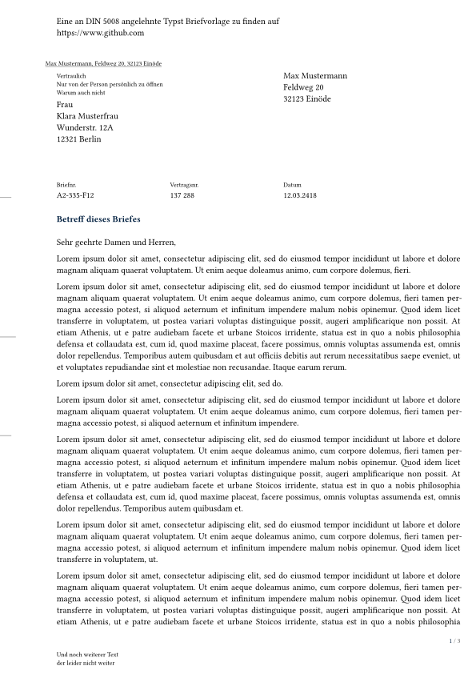

# typst-din-5008-letter
A template for [DIN 5008](https://www.edv-lehrgang.de/din-5008) inspired [typst](https://typst.app/home) letter.

Furthermore, there is a envelope template.

## Reference

| Option | Type | Deutsch | English |
|---|---|---|---|
| `sender` | dict | Absender | Sender |
| `sender.name` | content | Name | Name |
| `sender.address` | content | Name & Anschrift | Name & Adress |
| `recipient` | dict | Empfänger | Recipient |
| `recipient.address` | content | Name & Anschrift | Name & Adress |
| `recipient.topextra` | content | Zusatz & Vermerkzone | Additional Info |
| `recipient.return_information` | content | Rücksendeangabe | return details |
| `title` | content | Betreff | Subject of letter |
| `date` | content | Datum für Kopfzeile | Date for header |
| `reference_signs` | array of content pairs | Bezugszeichen | reference signs |
| `header` | content | Kopfzeile der 1. Seite | Header of 1st page |
| `footer` | content | Fußzeile der 1. Seite | Footer of 1st page |
| `options` | dict | Klassenoptionen | class options |
| `options.form` | str | Typ A / B | type A / B |
| `options.folding_mark` | bool | Falzmarken? | folding marks? |
| `options.hole_mark` | bool | Lochmarke? | hole mark? |
| `options.pagemarginright` | dim | Rechter Rand | right margin |
| `options.handsigned` | bool | Unterschrift? | Signed? |
| `options.themecolor` | color | Themenfarbe | theme color |
| `options.salutation` | content | Grußformel / Anrede | greeting |
| `options.closing` | content | Grußformel am Ende | closing |

In examples directory is `template_letter.*` which maps all fields of this class to a pdf.

## Usage
To use the template, create a file next to `letter.typ` and use the important parts of this:

```typst
#import "letter.typ" : letter, defaults
#let empfänger = (
  address: [Frau\ Klara Musterfrau\ Wunderstr. 12A\ 12321 Berlin],
  topextra: [Vertraulich\ Nur von der Person persönlich zu öffnen\ Warum auch nicht],
  return_information: [Max Mustermann, Feldweg 20, 32123 Einöde]
)

#let absender = (
  name: [Max Mustermann],
  address: [Max Mustermann\ Feldweg 20\ 32123 Einöde]
)

#{
  defaults.form = "A" // can also be form 'B'
  defaults.folding_mark = true
  defaults.hole_mark = true
  defaults.pagemarginright = 0.7cm
  //defaults.handsigned = true
}

#show: letter.with(
  sender: absender,
  recipient: empfänger,
  title: [Betreff dieses Briefes],
  date: [12.03.2418],
  options: defaults,
  reference_signs: (
    ([Briefnr.], [A2-335-F12]),
    ([Vertragsnr.], [137 288]),
    ([Datum], [12.03.2418])
  ),
  header: [Eine an DIN 5008 angelehnte Typst Briefvorlage zu finden auf #link("https://www.github.com")],
  footer: [Und noch weiterer Text\ der leider nicht weiter]
)

#for i in (3, 12, 3, 12, 15, 35, 1) {
  lorem(10*i)
  parbreak()
}
```

The resulting pdf is included in the `examples` directory, but the first page looks like this:



### Tipps
Add a `my_defaults.typ` to your project, where you save your own informations and settings, which do not change, during multiple interactions, then it can be loaded into the other files.

## ToDo's
Because certain functionality is not possible in typst right now, here are some things I want to add later on.
- [ ] Footer depending on page number with correct sizing
- [ ] Even and odd pages distinction, so that margin fits
- [ ] More flexible design

Furthermore, if someone has any ideas on how to improve this class, feel free to create an issue or better a PR.